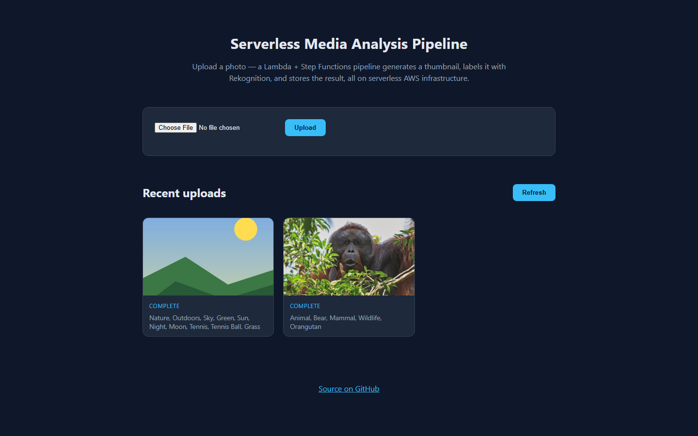
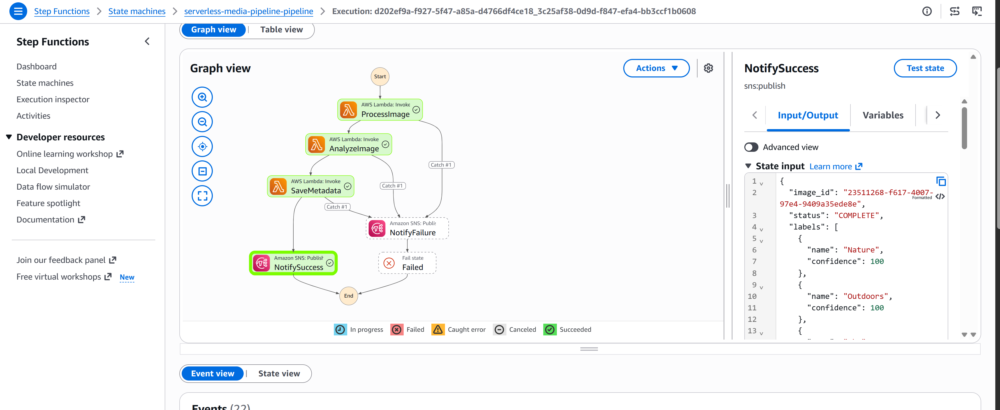
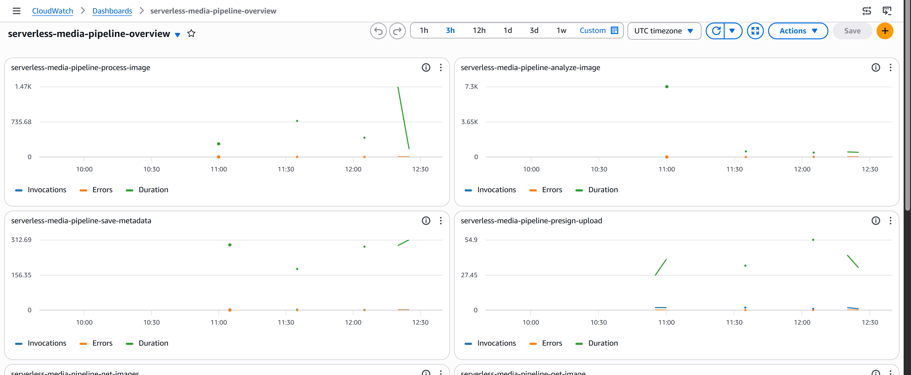
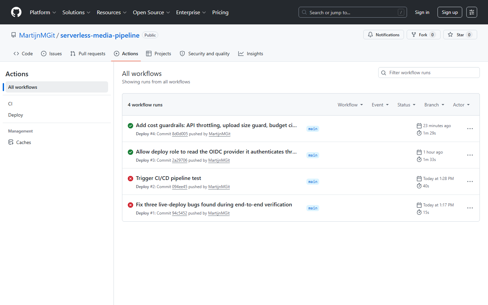

# Serverless Media Analysis Pipeline

Upload a photo and get back a thumbnail plus a set of AI-generated labels. Built on AWS Lambda, Step Functions, API Gateway, DynamoDB and Rekognition, deployed with Terraform, shipped through GitHub Actions.

**Live demo:** https://media.martinscloud.be

## Why this project exists

My first portfolio project, [martinscloud.be](https://www.martinscloud.be), runs on a single EC2 instance with Nginx, Flask and SQLite. It taught me the VM side of AWS: VPC design, security groups, TLS, systemd, backups, and a full cross-region migration. Three things were missing from it: serverless architecture, Terraform, and CI/CD.

This project covers exactly that gap, and it is deliberately the opposite style of application. Nothing runs when nobody uses it, all infrastructure lives in version-controlled Terraform, and a push to main deploys to production without me opening the AWS console.

## How it works

```
Browser (frontend on S3 + CloudFront, media.martinscloud.be)
  │
  ├─ GET  /api/images        → API Gateway (HTTP API) → Lambda get_images     → DynamoDB
  ├─ GET  /api/images/{id}   → API Gateway            → Lambda get_image      → DynamoDB
  └─ POST /api/uploads       → API Gateway            → Lambda presign_upload → returns S3 presigned PUT URL
                                                                                    │
Browser PUTs the file directly to S3 ─────────────────────────────────────────────┘
  │
  ▼
S3 (uploads/ prefix) ──EventBridge──▶ Step Functions (Standard workflow)
                                        1. process_image  (Pillow thumbnail  → S3 processed/)
                                        2. analyze_image  (Rekognition DetectLabels)
                                        3. save_metadata  (write result → DynamoDB)
                                        4. SNS topic → email ("upload processed")
```

A typical upload, step by step:

1. The browser asks the API for an upload URL. A Lambda returns a presigned S3 PUT URL, valid for five minutes and restricted to image content types.
2. The browser uploads the file straight to S3. The file never passes through Lambda or API Gateway, which sidesteps the API Gateway 10 MB payload limit and keeps the Lambda bill at zero for the heavy part.
3. S3 publishes the new object to EventBridge, and a rule starts a Step Functions execution. Three Lambdas run in sequence: thumbnail generation with Pillow, content moderation plus label detection with Rekognition, and a metadata write to DynamoDB. An SNS email confirms success or failure.
4. The gallery page polls the API until the result appears, usually within three seconds.

The frontend, the API and the images are all served by one CloudFront distribution under one domain. Because the browser never makes a cross-origin request, there is no CORS configuration anywhere in the project.

## Design decisions

**Step Functions rather than one big Lambda.** The three processing stages could easily live in a single function. Splitting them means each stage retries independently (a Rekognition hiccup does not redo the thumbnail work), the execution history in the console shows exactly which stage failed with what input, and each function gets an IAM role with only the permissions its own job needs. The public gallery endpoint physically cannot write to S3 or call Rekognition.

**S3 to EventBridge to Step Functions, with no glue Lambda in between.** S3 can publish object-created events directly onto the EventBridge bus, and an EventBridge rule can start a state machine execution by itself. A shim Lambda here would be one more thing to maintain for no benefit.

**Terraform, not CloudFormation.** The EC2 project already uses CloudFormation, so this one deliberately uses the other major IaC tool. State lives in an S3 backend with a DynamoDB lock table, bootstrapped once by a separate config in `terraform/bootstrap`.

**GitHub OIDC instead of access keys.** The deploy workflow assumes an IAM role using short-lived OIDC tokens. No AWS credentials are stored in GitHub secrets. The trust policy accepts exactly two subjects, pushes to main and pull requests, so a fork cannot assume the role.

**ACM here, Let's Encrypt on the EC2 project.** ACM certificates only attach to CloudFront and load balancers, which is why the EC2 site uses Certbot instead. With CloudFront in front, ACM becomes the right tool. Having hit both constraints in two projects is a useful thing to be able to explain.

## Things that went wrong

Every one of these happened during the real deployment and is visible in the commit history.

**Rekognition does not exist in eu-west-3.** The whole stack lives in Paris, and the first live pipeline run died with a connection error to `rekognition.eu-west-3.amazonaws.com`. Rekognition simply is not offered there, and its S3Object input mode only accepts buckets in the same region as the endpoint anyway. The fix reads the thumbnail bytes in Paris and sends them inline to a Rekognition client pinned to eu-west-1.

**Presigned URLs pointed at the wrong S3 endpoint.** boto3 signs presigned URLs against the global `s3.amazonaws.com` host by default. For buckets outside us-east-1, S3 answers with a 307 redirect, which a presigned PUT cannot follow. Uploads failed until the client was pinned to the regional endpoint with virtual-hosted addressing.

**Every image returned 403 through CloudFront.** Public image URLs live under `/media/*` so they can share the distribution with the frontend, but the object keys in the bucket have no `media/` prefix. CloudFront forwarded the full path and S3 saw requests for keys that do not exist. A four-line CloudFront Function now strips the prefix before the request reaches the origin.

**DynamoDB refuses Python floats.** Rekognition returns confidence scores as floats, and the DynamoDB resource API only accepts Decimal. This one never reached AWS: the pytest suite with moto caught it locally, which is the best advertisement for writing those tests I can offer.

**The deploy role could not read its own front door.** The CI role's IAM policy was scoped to resources named after the project, but Terraform also manages the OIDC provider itself, whose ARN carries GitHub's name instead. The first CI run failed refreshing state on the one resource that authenticates the role doing the refreshing. It got a read-only permission for exactly that ARN.

**Gmail kept unsubscribing me from my own alerts.** Every SNS email contains a one-click unsubscribe link, and mail scanners follow links. Each notification instantly killed its own subscription. Confirming the subscription with `AuthenticateOnUnsubscribe=true` means unsubscribing now requires AWS credentials, which a link scanner does not have.

## Cost

| Component | Monthly cost at portfolio traffic |
|---|---|
| Lambda | $0 (permanent free tier, 1M requests) |
| DynamoDB | $0 (on-demand, permanent free tier) |
| API Gateway (HTTP API) | fractions of a cent |
| Step Functions | $0.025 per 1,000 state transitions |
| Rekognition | ~$1 per 1,000 images after the first-year free tier |
| S3, SNS, CloudWatch | fractions of a cent |
| CloudFront | $0 (always-free tier covers 1 TB/month) |

Keeping it cheap is enforced, not hoped for:

- API Gateway throttles at 10 requests per second (burst 20), so a scripted loop against the upload endpoint cannot generate unbounded Rekognition and Step Functions spend. Verified by firing a 60-request burst and watching the 429s come back.
- Presigned PUT URLs cannot enforce a file size, so `process_image` checks the object size from the S3 event and rejects anything over 10 MB before reading a single byte.
- An AWS Budgets Action works as a circuit breaker. Budget alerts only send email; they never stop anything. This action automatically attaches a deny-all IAM policy to all six Lambda roles when spend crosses the $5 budget, which halts the pipeline until I detach the policy manually. That is as close to a hard spending cap as AWS offers.
- A lifecycle rule deletes uploads and thumbnails after 30 days.

## Security

Every Lambda has its own IAM role with only the permissions its job needs. The presign function can write to the `uploads/` prefix and nothing else, the metadata writer can only put items in the one table, and the public gallery endpoints can only read. A bug in one function does not become access to everything else.

The buckets are not public. CloudFront reaches them through Origin Access Control, and each bucket policy only accepts requests signed by this specific distribution. Upload URLs are presigned, expire after five minutes, accept only image content types, and filenames are stripped to safe characters before they become object keys, so a hostile filename cannot smuggle path segments into the bucket.

Uploads are content-moderated before anything goes public. Rekognition's `DetectModerationLabels` runs ahead of label detection, and a flagged upload is deleted on the spot, original and thumbnail both, before any database record exists. The gallery can only ever show content that passed the check.

CI/CD holds no credentials. GitHub Actions authenticates with short-lived OIDC tokens, and the role's trust policy names exactly two allowed subjects, pushes to main and pull requests on this repository, so a fork cannot assume the deploy role. The API throttling and the budget circuit breaker described under Cost double as abuse protection.

## Testing

18 pytest unit tests, one file per Lambda handler, with AWS mocked through moto. Each handler is loaded as an isolated module so the six identically-named `handler.py` files do not collide. The float/Decimal bug above was caught by these tests before the code ever reached AWS. CI runs the suite plus `terraform fmt`, `validate` and `plan` on every pull request; merges to main apply the infrastructure, sync the frontend to S3 and invalidate the CloudFront cache.

## Repo layout

```
serverless-media-pipeline/
├── terraform/               # root config + modules (storage, database, lambda,
│   │                        #   step_functions, api_gateway, sns, cloudfront,
│   │                        #   budget, monitoring, github_oidc)
│   └── bootstrap/           # one-time: Terraform state S3 bucket + lock table
├── lambdas/                 # one directory per function
├── step_functions/          # state machine definition (Terraform templatefile)
├── frontend/                # plain HTML/CSS/JS upload form + gallery
├── tests/                   # pytest + moto, one file per Lambda
├── scripts/build_pillow_layer.sh
└── .github/workflows/       # ci.yml (PR checks), deploy.yml (main branch)
```

One packaging note: Pillow contains compiled C code, so the Lambda layer is built by asking pip for the Linux x86_64 wheel explicitly (`--platform manylinux2014_x86_64`). The same script works on my Windows machine and on the GitHub Actions runner, with no Docker involved.

## Running it yourself

```bash
git clone https://github.com/MartijnMGit/serverless-media-pipeline.git
cd serverless-media-pipeline

python -m venv .venv
source .venv/Scripts/activate    # Windows Git Bash
pip install -r tests/requirements-test.txt
pytest tests/ -v
```

Deploying the infrastructure:

```bash
bash scripts/build_pillow_layer.sh   # must run before any plan or apply
cd terraform
terraform init
terraform plan  -var="notification_email=you@example.com"
terraform apply -var="notification_email=you@example.com"
```

## Screenshots

The live demo page after a couple of uploads:



A Step Functions execution, with the caught-error branches visible next to the green path:



The CloudWatch dashboard tracking invocations, errors and duration per function:



The CI/CD history, including the two failed runs that became the "things that went wrong" section above:


